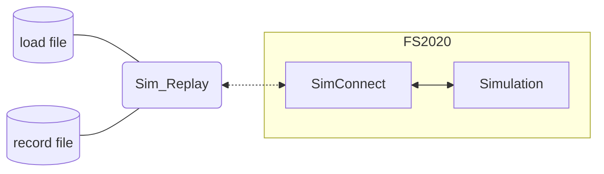
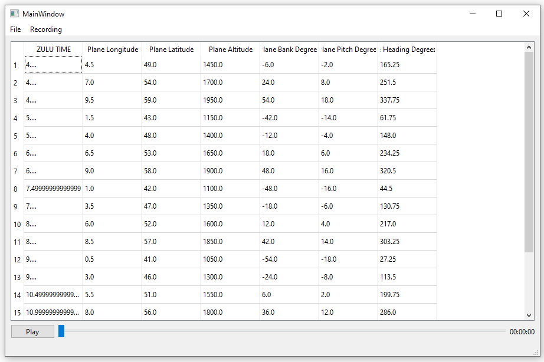

# Sim_Replay

FS2020 -> Simconnect -> python -> a record

## Presentation

The main purpose of this application is to load a plane trajectory acquired via an external system (SDVFR, XPlane...) and replay it in the flight simulator FS2020 thanks to SimConnect API. It can also record a flight done directly from FS2020 and save it as a *.csv* file.

## Startup

At least **Python 3.10** version is necessary to use the app (yes there are **matches**, wouhou !)

To run the app, put the `SimConnect.dll` in the project folder and run `python main.py` at the same place, but you can also use a decent IDE.

To run the UI app, run `python mainQt.py` with **PySide6** installed

## Usefull links

[Simconnect API](https://docs.flightsimulator.com/)
