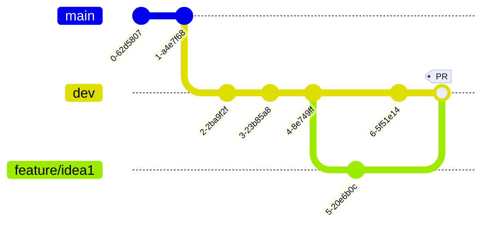

# Sim_Replay

FS2020 -> Simconnect -> python -> a record

## Startup

At least *Python 3.10* version is necessary to use the app (yes there are **matches**, wouhou !)

To run the app, put the `SimConnect.dll` in the project folder and run `python main.py` at the same place, but you can also use a decent IDE.

## Git Practices

The project has two main branches:

* the *main* branch that contains publishable versions of the app
* the *dev* branch that is the working branch to add features in code

As a contributor, the recommended way to add code in project is to create a branch on the latest commit of the *dev* branch with a name that begins with "*feature/*". When the feature is fully developped, a merge (after a Pull Request ideally) can be done into the *dev* branch.

Ex :

