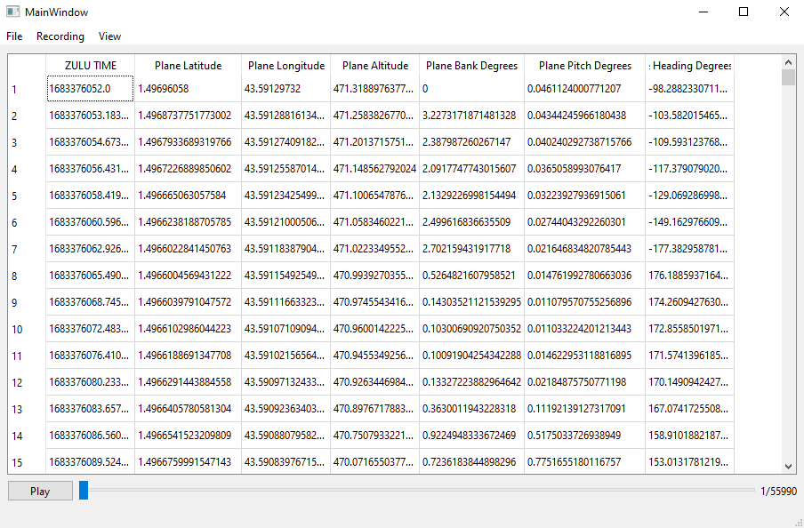

# Sim_Replay

FS2020 -> Simconnect -> python -> a record

## Presentation

The main purpose of this application is to load a plane trajectory acquired via an external system (SDVFR, XPlane...) and replay it in the flight simulator FS2020 thanks to SimConnect API. It can also record a flight done directly from FS2020 and save it as a *.csv* file.

## Startup

- At least **Python 3.10** version is necessary to use the app (yes there are **matches**, wouhou !)

- To add all requested module dependencies, run the command `pip install -r requirements.txt`.

- To run the UI app, simply run the command `python -m src.main.python.mainQt`.

> Many functionnalities are available natively, but if you need the ones that require a direct connection to FS2020, you shall also add the `SimConnect.dll` file in the project folder.

## Build Automation

>*Not necessary for conventional usage and development*

To fully build the project, the build automation tool named **PyBuilder** is used. It is already included in the module dependencies required to run the app.

To use it, simply run the command `pyb`. It will run unit tests, run **behave**, do a coverage analysis and create a building distribution.

## Usefull links

[Simconnect API](https://docs.flightsimulator.com/)
